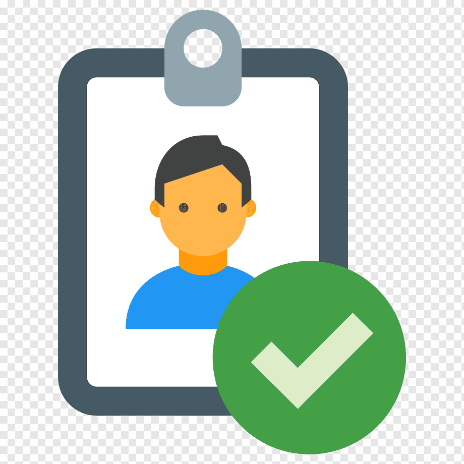

<a name="readme-top"></a>
<!-- [![Contributors][contributors-shield]][contributors-url]
[![Forks][forks-shield]][forks-url]
[![Stargazers][stars-shield]][stars-url]
[![Issues][issues-shield]][issues-url]
[![MIT License][license-shield]][license-url]
[![LinkedIn][linkedin-shield]][linkedin-url] -->


<!-- PROJECT LOGO -->
<br />
<div align="center">
  <a href="https://github.com/akg07/Node-Authentication">
    
  </a>

  <h3 align="center">Node Authentication</h3>

  <p align="center">
    An authenticaiton configuration which can be attach to any project
    <br />
    <a href="https://github.com/akg07/Node-Authentication#readme"><strong>Explore the docs »</strong></a>
    <br />
    <br />
    <a href="https://github.com/akg07/Node-Authentication#readme">View Demo</a>
    ·
    <a href="https://github.com/akg07/Node-Authentication/issues">Report Bug</a>
    ·
    <a href="https://github.com/akg07/Node-Authentication/issues">Request Feature</a>
  </p>
</div>


<!-- TABLE OF CONTENTS -->
<details>
  <summary>Table of Contents</summary>
  <ol>
    <li>
      <a href="#about-the-project">About The Project</a>
      <ul>
        <li><a href="#built-with">Built With</a></li>
      </ul>
    </li>
    <li>
      <a href="#getting-started">Getting Started</a>
      <ul>
        <li><a href="#prerequisites">Prerequisites</a></li>
        <li><a href="#installation">Installation</a></li>
      </ul>
    </li>
    <li><a href="#usage">Usage</a></li>
    <li><a href="#contact">Contact</a></li>
    <li><a href="#acknowledgments">Acknowledgments</a></li>
  </ol>
</details>


<!-- ABOUT THE PROJECT -->
## About The Project

[![Login page Screen Shot][product-screenshot]](https://github.com/akg07/Node-Authentication/blob/master/assets/Project_imgs/Login_img.png)


This project is a complete package for all authentication related features.


Here's what features it includes:
* Login and signup with re-captcha
* Google signIn/ SignUp feature included
* Change password using link (in case of forgot password)
* Upate password while logged in (by re-verifing yourself);
* User's password has been stored in encrypted manner
* Password change link will be sent as a parallel job (priority based)
* Show real-time notification while login or signup and password change process


Of course, There are some scope to modify and update the existing feature. I am open for all suggestions and I will try to continously upgarde the features as time goes.


<p align="right">(<a href="#readme-top">back to top</a>)</p>

### Sample Images
Here are some sample images of the project. Have a quick look

#### Signup page 
![SignUp Page Screen Shot][signup-screenshot]

#### Home page 
![home Page Screen Shot][home-screenshot]

#### Profile page 
![profile Page Screen Shot][profile-screenshot]

#### Re-verify User
![Re-verify Page Screen Shot][Re-verify-screenshot]

#### Update password page 
![update password Page Screen Shot][update-password-screenshot]


### Built With

This project is build with various libraries and frameworks. Some of them is listed below

* [Node Js](https://nodejs.org/en/)
* [Express Js](http://expressjs.com/)
* [Nodemailer](http://nodemailer.com/about/)
* [Redis](https://redis.io/)
* [Bootstrap](https://getbootstrap.com/)
* [JQuery](https://jquery.com/)

<p align="right">(<a href="#readme-top">back to top</a>)</p>


<!-- GETTING STARTED -->
## Getting Started

For start the project you need to have some prerequisites.

### Prerequisites
npm is mandatory for install and runing the project

* npm
  ```sh
  npm install npm@latest -g
  ```

### Installation

Clone the project from Git and install all the required libraries for the project

1. Clone the repo
   ```sh
   git clone https://github.com/akg07/Node-Authentication.git
   ```
2. Install NPM packages
   ```sh
   npm install
   ```

<p align="right">(<a href="#readme-top">back to top</a>)</p>

## Configure

Here you have to make some configuraiton to run this project on your system
1. Install nodemon using npm (Ignore if already Installed)
    ```
    npm install nodemon
    ```

2. Install Redis-server  on your system
    * If you are a windows user do below steps
    * Step Up WSL
        * Run Windows Powershell as Administrator
        * Run the following command
            ```
            Enable-WindowsOptionalFeature -Online -FeatureName  Microsoft-Windows-Subsystem-Linux
            ```
        * Reboot Windows after making the change
        * Download Ubuntu Distros from windows store 
            ```
            https://apps.microsoft.com/store/detail/ubuntu-1804-on-windows/ 9N9TNGVNDL3Q?hl=en-us&gl=us
            ```
    * Install and run redis
        * Launch the downloaded distro and run the following
commands
            ```
            sudo apt-get update
            sudo apt-get upgrade
            sudo apt-get install redis-server
            redis-cli -v
            ```
    * <b>Remember</b> : Run redis server by using command <b>Redis-sever</b> before runing project

3. Register the application on google-cloud to get OAuth2 keys, you can replace yours with mine. <b>How to generate? Please Google it</b>
    * Client Id
    * Client Secret
    * Callback URL
    * add all this keys in config/app_keys.js file

4. Register the application to google re-captcha, <b>Don't know how to register? Google It</b>
    * Site-key
    * screte-key
    * Add this screte-key in config/app_keys.js file

5. Create an app password for this application to use nodemailer, Steps are
    * Sign In to google
    * Click on manage your google account
    * Click on Security
    * Go to Signing in to Google section
    * Create a new App password
    * A new encrypted password will be generated use this password and your email Id as username in config/app_keys.js file

6. Now all configurations has been completed, run below command in terminal to run the application
    ```
    npm start
    ```
7. On browser write URL <b>localhost:8080/home</b>


<!-- CONTACT -->
## Contact
In Case of any issue related to project setup or anything please contact me on ayush3032@gmail.com 

Aayush Kumar Gupta - [@Aayushkg_07](https://twitter.com/Aayushkg_07) - ayush3032@gmail.com

Project Link: [https://github.com/akg07/Node-Authentication](https://github.com/akg07/Node-Authentication)

<p align="right">(<a href="#readme-top">back to top</a>)</p>


<!-- ACKNOWLEDGMENTS -->
## Acknowledgments


* [Open Source License](https://choosealicense.com)
* [Geeks for Geeks](https://www.geeksforgeeks.org/)
* [Font Awesome](https://fontawesome.com)
<p align="right">(<a href="#readme-top">back to top</a>)</p>


<!-- MARKDOWN LINKS & IMAGES -->
<!-- https://www.markdownguide.org/basic-syntax/#reference-style-links -->

[linkedin-shield]: https://img.shields.io/badge/-LinkedIn-black.svg?style=for-the-badge&logo=linkedin&colorB=555

[linkedin-url]: https://linkedin.com/in/othneildrew

[product-screenshot]: assets/Project_imgs/Login_img.png

[signup-screenshot]: assets/Project_imgs/Signup_img.png

[home-screenshot]: assets/Project_imgs/home_img.png

[profile-screenshot]: assets/Project_imgs/profile_img.png

[update-password-screenshot]: assets/Project_imgs/update_password_img.png

[Re-verify-screenshot]: assets/Project_imgs/reverify_user_img.png
